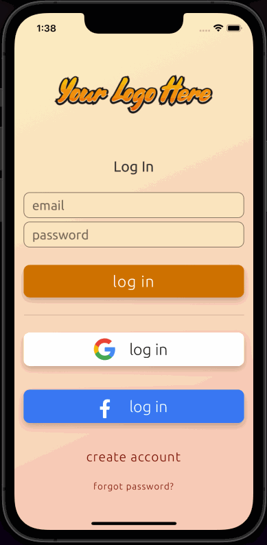
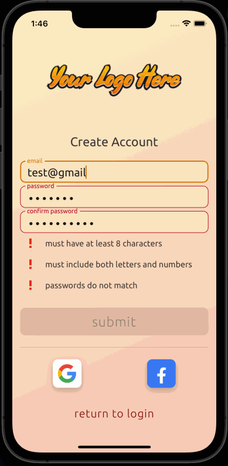
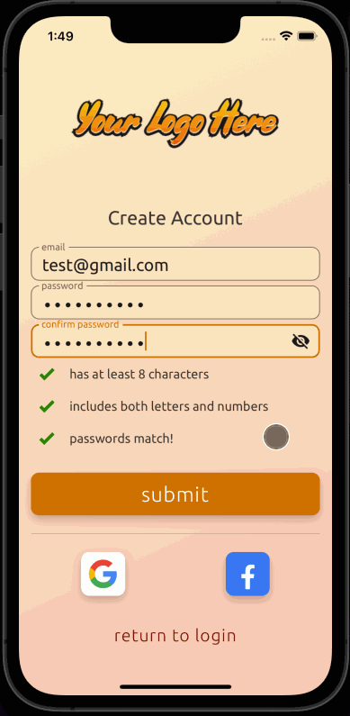
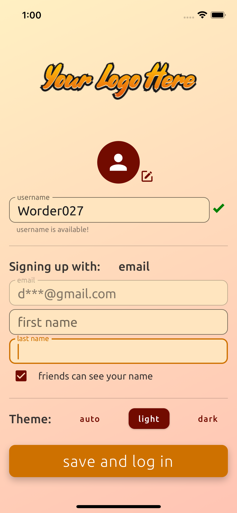
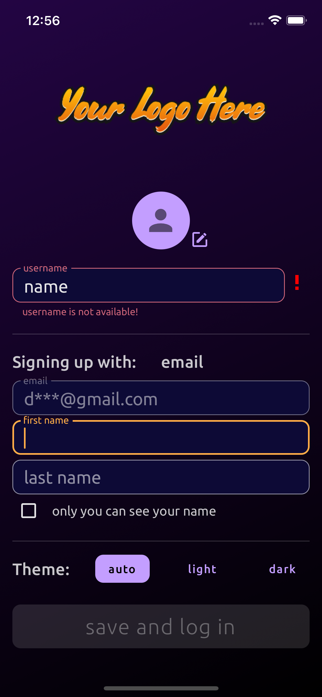
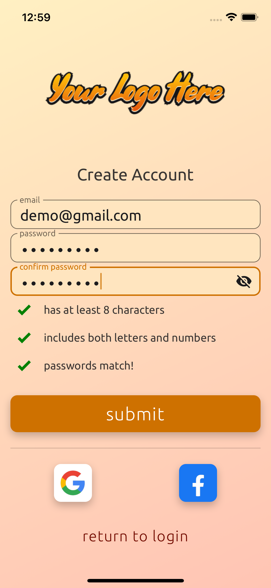
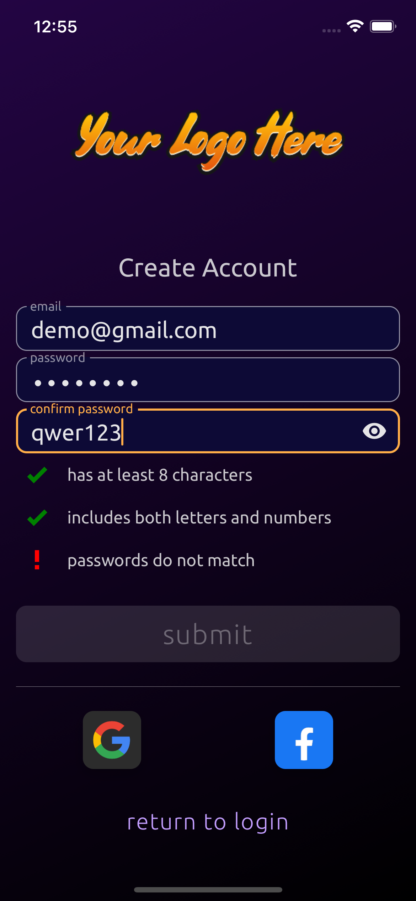
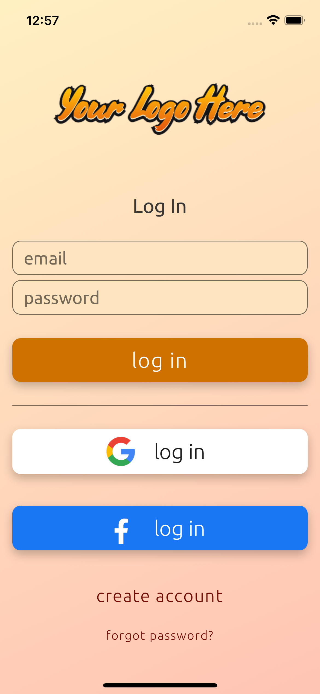
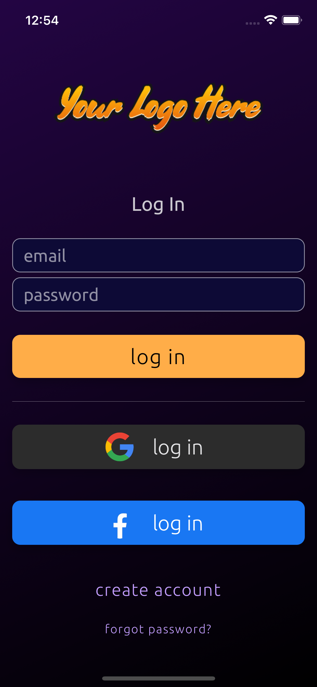

# react-native-expo-login-template

This template can be used as a jumping off point for creating a new React Native mobile app with an Expo Managed build. It integrates the use of the [React Native Paper](https://reactnativepaper.com/) and [React Navigation](https://reactnavigation.org/) libraries for UI/UX in addition to custom components.

# Main Features:

- Log In or Sign Up with email or OAuth (Google & Facebook)
- Supports custom fonts and themes, including dark/light modes (customizable)
- Client-Side email/password validations during account creation
- Visual input error feedback, including deactivated submit buttons until requirements are met
- Optional Finalize-Account screen to set key user settings before initial log-in

## Navigation

	

		
	

	<ul style="min-width:200px;">
		<li>Uses <a href="https://reactnavigation.org/">React Navigation</a> to navigate seamlessly between screens with swipe-fade animation</li>
		<li>By default, title image remains stationary while navigating between authentication screens</li>
	</ul>

## Validations

	

		
	

	<ul style="min-width:200px">
		<li>Create Account form cannot be submitted until all validations are met</li>
		<li>Email field will flag an error for non-email inputs</li>
		<li>All password validations reflect status to the user as they type</li>
		<li>Password Fields can each independently toggle visibility</li>
	</ul>

## Optional Finalization

	

		
	

	<ul style="min-width:200px">
		<li>Can navigate to optional Finalize Account screen on succesful account creation</li>
		<li>Allows user to edit: Avatar, Username, Name Visibility, and Theme</li>
		<li>Username field set up for automatically checking username availability with server</li>
		<li>First/Last name fields are not editable if signing up with OAuth provider</li>
		<li>"auto" theme selection can detect phone system dark-mode settings</li>
	</ul>

# Included Screens & Screenshots

		

		

			<h2 style="text-align:center">Finalize Account Screen</h2>
		

		

			
			
		

	

	

		

			<h2 style="text-align:center">Create Account Screen</h2>
		

		

			
			
		

	

	

		

			<h2 style="text-align:center">Login Screen</h2>
		

		

			
			
		

	

# Setup

## note: setup instructions are in process of being written at this time and may be incomplete

In app.json:

- set "name" and "slug" to your <app name>
- set "bundleIdentifier", "package", and "scheme" according to Oauth settings
- set desired splash/icon images and settings

In TitleImage.js

- set titleLight and titleDark to the image asset(s) desired for light/dark themes

In useGoogleAuth.js

- enter your Client IDs for your google auth app

In useFacebookAuth.js

- enter your Client IDs for your facebook auth app
